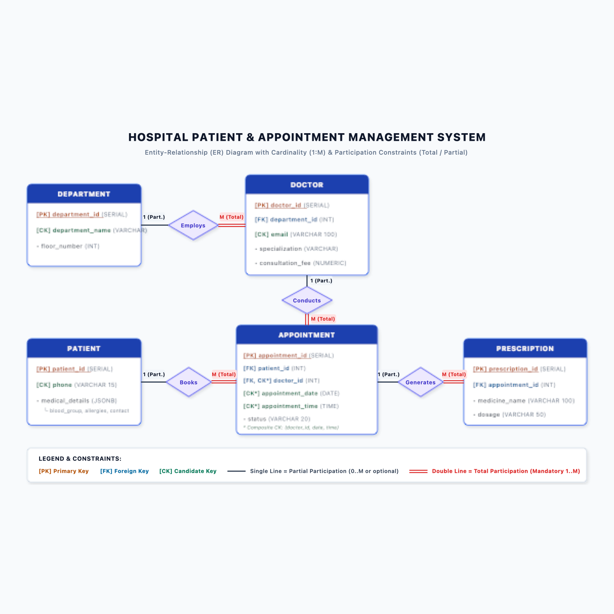

# 🏥 Hospital Patient & Appointment Management System

[](https://www.postgresql.org/)
[](https://en.wikipedia.org/wiki/SQL)
[](https://en.wikipedia.org/wiki/ACID)
[]()

A relational database engineering project modeled and implemented in **PostgreSQL**. The system manages multi-specialty hospital operations, physician scheduling with **anti-double-booking integrity constraints**, patient semi-structured **EHR data using JSONB**, and **clinical transaction safety with SQL savepoints**.

---

## 📑 Table of Contents
- [System Architecture & ER Diagram](#-system-architecture--er-diagram)
- [Relational Schema & Key Constraints](#-relational-schema--key-constraints)
- [Key Features & Advanced Queries](#-key-features--advanced-queries)
  - [Q1: Correlated Subquery](#q1-correlated-subquery--doctors-above-department-average-fee)
  - [Q2: Left Outer Join with Zero Aggregation](#q2-left-outer-join--appointment-counts-per-doctor)
  - [Q3: JSONB Semi-Structured Data Querying](#q3-jsonb--penicillin-allergy-detection-via--operator)
  - [Q4: ACID Transactions & SAVEPOINT Rollback](#q4-acid-transactions--clinical-allergy-safety-with-savepoint)
- [Visual Execution Proofs (Terminal Captures)](#-visual-execution-proofs-terminal-captures)
- [Quick Start & Setup](#-quick-start--setup)
- [Repository Structure](#-repository-structure)
- [Author](#-author)

---

## 🏛️ System Architecture & ER Diagram

The system comprises 5 core entities: `Department`, `Doctor`, `Patient`, `Appointment`, and `Prescription`.


*(Vector graphic available: [`er_diagram.svg`](er_diagram.svg))*

### Cardinality & Participation Specifications:
* **Department 1 — M Doctor:** 
  - **Doctor Participation:** Total (Every doctor must belong to a department, `NOT NULL`).
  - **Department Participation:** Partial (Departments can exist before doctors are hired).
* **Doctor 1 — M Appointment:** 
  - **Appointment Participation:** Total (Appointments must be assigned to an active doctor).
  - **Doctor Participation:** Partial (Doctors can exist with zero appointments).
* **Patient 1 — M Appointment:** 
  - **Appointment Participation:** Total (Every appointment is booked for a registered patient).
  - **Patient Participation:** Partial (Patients can be registered before scheduling an appointment).
* **Appointment 1 — M Prescription:** 
  - **Prescription Participation:** Total (Prescriptions are strictly bound to a consultation appointment).
  - **Appointment Participation:** Partial (An appointment may conclude without issuing medications).

---

## 🔑 Relational Schema & Key Constraints

| Table Name | Primary Key (PK) | Candidate Key (Not PK) | Foreign Keys (FK) & References | Composite Key & Constraint |
| :--- | :--- | :--- | :--- | :--- |
| **Departments** | `department_id` | `department_name` (UNIQUE) | *None* | *None* |
| **Doctors** | `doctor_id` | `email` (UNIQUE) | `department_id` → `Departments(department_id)` | *None* |
| **Patients** | `patient_id` | `phone` (UNIQUE) | *None* | *None* |
| **Appointments** | `appointment_id` | `(doctor_id, appointment_date, appointment_time)` | `patient_id` → `Patients(patient_id)`<br>`doctor_id` → `Doctors(doctor_id)` | `UNIQUE(doctor_id, appointment_date, appointment_time)` |
| **Prescriptions** | `prescription_id` | `(appointment_id, medicine_name)` | `appointment_id` → `Appointments(appointment_id)` | *None* |

### 🛡️ Double-Booking Prevention Rule:
> **`UNIQUE (doctor_id, appointment_date, appointment_time)`**  
> In hospital scheduling, a doctor cannot physically consult two patients simultaneously. This composite unique candidate key guarantees at the storage engine level that overlapping appointments cannot be scheduled for the same doctor at the same date and time slot.

---

## ⚡ Key Features & Advanced Queries

### Q1: Correlated Subquery — Doctors Above Department Average Fee
Finds doctors charging higher consultation fees than the average of their own department.
```sql
SELECT 
    d.doctor_id, 
    d.department_id, 
    d.email, 
    d.specialization, 
    d.consultation_fee
FROM doctors d
WHERE d.consultation_fee > (
    SELECT AVG(d2.consultation_fee)
    FROM doctors d2
    WHERE d2.department_id = d.department_id
);
```
* **Output:** Dr. Asha Rao (800 > 725 dept avg) & Dr. Neha Jain (700 > 625 dept avg).

---

### Q2: Left Outer Join — Appointment Counts per Doctor
Lists all doctors and their appointment counts, accurately reporting **0** for doctors without bookings.
```sql
SELECT 
    d.doctor_id,
    d.email,
    COUNT(a.appointment_id) AS appointment_count
FROM doctors d
LEFT JOIN appointments a ON d.doctor_id = a.doctor_id
GROUP BY d.doctor_id, d.email
ORDER BY d.doctor_id;
```
* **Engineering Insight:** `COUNT(a.appointment_id)` is used instead of `COUNT(*)`. `COUNT(column)` ignores `NULL` records generated by unmatched outer joins, yielding 0 rather than 1.

---

### Q3: JSONB — Penicillin Allergy Detection via `?` Operator
Searches semi-structured EHR records stored inside `medical_details` JSONB column.
```sql
SELECT 
    patient_id,
    phone,
    medical_details
FROM patients
WHERE medical_details->'allergies' ? 'penicillin';
```
* **Engineering Insight:** Uses PostgreSQL's indexed JSON existence operator `?` to query within nested arrays.

---

### Q4: ACID Transactions — Clinical Allergy Safety with SAVEPOINT
Books an appointment, attempts a contraindicated medication (Penicillin), and rolls back **only** the prescription while saving the consultation appointment.
```sql
BEGIN;

-- 1. Book the appointment
INSERT INTO appointments (patient_id, doctor_id, appointment_date, appointment_time, status)
VALUES (1, 2, '2026-09-23', '10:30:00', 'Scheduled');

-- 2. Establish SAVEPOINT prior to prescription insertion
SAVEPOINT prescription_savepoint;

-- 3. Attempt contraindicated medication (Allergic to Penicillin)
INSERT INTO prescriptions (appointment_id, medicine_name, dosage)
VALUES (5, 'Penicillin', '500mg twice daily');

-- 4. Rollback ONLY the hazardous prescription
ROLLBACK TO SAVEPOINT prescription_savepoint;

-- 5. Commit transaction (Appointment booking is finalized)
COMMIT;
```

---

## 📸 Visual Execution Proofs (Terminal Captures)

### Database Creation & Data Seeding
| Step | Description | Preview |
| :---: | :--- | :---: |
| **01** | `psql` Session Initialization | [Screenshot 1](1.png) |
| **02** | `departments` Table DDL | [Screenshot 2](2.png) |
| **03** | `doctors` Table DDL | [Screenshot 3](3.png) |
| **04** | `patients` Table DDL (JSONB) | [Screenshot 4](4.png) |
| **05** | `appointments` Table DDL | [Screenshot 5](5.png) |
| **06** | `prescriptions` Table DDL | [Screenshot 6](6.png) |
| **07 - 11** | Data Ingestion | [7.png](7.png) • [8.png](8.png) • [9.png](9.png) • [10.png](10.png) • [11.png](11.png) |
| **12** | Multi-Table Verification | [Screenshot 12](12.png) |

### Query Results
| Query | Description | Preview |
| :---: | :--- | :---: |
| **Q1** | Correlated Subquery | [Screenshot 13](13.png) |
| **Q2** | LEFT JOIN with Zero Counts | [Screenshot 14](14.png) |
| **Q3** | JSONB Allergy Querying | [Screenshot 15](15.png) |
| **Q4** | Transaction & SAVEPOINT Rollback | [16.png](16.png) • [17.png](17.png) • [18.png](18.png) • [19.png](19.png) |

---

## 🚀 Quick Start & Setup

### 1. Prerequisites
- PostgreSQL 14+ installed and running.

### 2. Clone Repository
```bash
git clone https://github.com/Kunallubhana77/db.git
cd db
```

### 3. Create & Seed Database
Run the complete SQL script in PostgreSQL:
```bash
# Create database
createdb hospitaldb

# Run schema and seed script
psql -d hospitaldb -f schema.sql
```

### 4. View Formatted Reports
- Open [`REPORT.html`](REPORT.html) in any browser for printable PDF report styling.
- Read [`REPORT.md`](REPORT.md) for GitHub-native project documentation.

---

## 📁 Repository Structure
```
├── README.md               # Main repository documentation & guide
├── REPORT.html             # High-fidelity, print-ready HTML project report
├── REPORT.md               # Comprehensive markdown project report
├── schema.sql              # Complete DDL, DML seed data, and analytical queries
├── er_diagram.png          # High-resolution raster ER Diagram (300 DPI)
├── er_diagram.svg          # Crisp vector source ER Diagram
├── 1.png - 6.png           # DDL Table creation execution captures
├── 7.png - 12.png          # Data ingestion & SELECT verification captures
└── 13.png - 19.png         # Analytical queries (Q1, Q2, Q3, Q4) execution captures
```

---

## 👤 Author
* **Kunal Lubhana**
* GitHub: [@Kunallubhana77](https://github.com/Kunallubhana77)

---
*Developed as part of the Database Management Systems (PostgreSQL) Mini Project coursework.*
